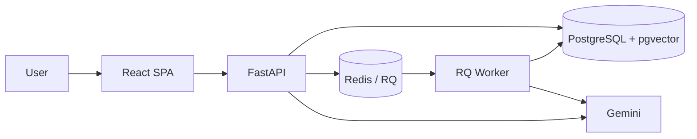
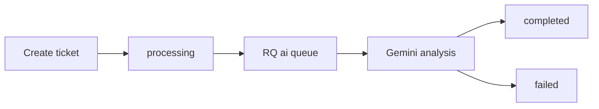
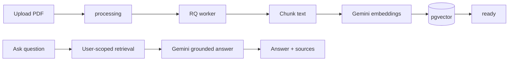

# AI Helpdesk

AI Helpdesk is a full-stack support console that combines user-owned ticket management with asynchronous Gemini analysis and a PDF-backed retrieval-augmented generation (RAG) knowledge base.

> Portfolio summary: A production-minded React and FastAPI application demonstrating JWT authentication, background jobs, PostgreSQL/pgvector semantic retrieval, grounded AI responses, migrations, deterministic testing, CI, and containerized local orchestration.

## Features

- JWT registration, login, protected routes, and user isolation
- Ticket CRUD with asynchronous categorization, prioritization, and summarization
- PDF ingestion with MIME validation, a configurable size limit, and safe parse errors
- Background chunking and Gemini embeddings
- User-scoped cosine retrieval through PostgreSQL and pgvector
- Grounded answers with source metadata
- Explicit processing, completed/ready, and failed states with modest retries
- Responsive React interface with background-status polling
- Alembic migrations, backend/frontend tests, Docker Compose, and CI

## Screenshots

Final captures can be added here for the dashboard, ticket lifecycle, RAG answer, and mobile layout.

## Architecture



### Ticket flow



Ticket and document jobs retry transient failures twice, after 10 and 30 seconds. If Redis cannot accept a job, the created record is retained and immediately marked failed with a safe message instead of remaining stuck in `processing`.

### RAG flow



Only ready documents owned by the current user are searched. Retrieval selects up to three chunks with cosine distance at or below `0.45`.

## Tech stack

- Backend: Python 3.12, FastAPI, SQLAlchemy 2, Alembic, Pydantic
- Authentication: JWT and Argon2 password hashing
- Data: PostgreSQL 16 and pgvector (`VECTOR(768)`)
- Jobs: Redis and RQ `SimpleWorker`
- AI: Google Gemini generation and embeddings
- PDF: pypdf
- Frontend: React 19, TypeScript, Vite, React Router, Axios
- Tests: pytest, Vitest, React Testing Library
- Operations: Docker Compose, Nginx, GitHub Actions

## Project structure

```text
.
├── backend/
│   ├── app/
│   │   ├── database/       # SQLAlchemy sessions
│   │   ├── dependencies/   # JWT authentication
│   │   ├── jobs/           # RQ jobs
│   │   ├── models/         # SQLAlchemy models
│   │   ├── queue/          # Redis queue and retry policy
│   │   ├── routes/         # API endpoints
│   │   ├── schemas/        # Pydantic models
│   │   └── services/       # AI, PDF, retrieval, and RAG
│   ├── migrations/         # Alembic history
│   ├── tests/              # Backend tests
│   └── Dockerfile
├── frontend/
│   ├── src/                # Pages, routes, layout, API, tests, utilities
│   ├── Dockerfile
│   └── nginx.conf
├── .github/workflows/ci.yml
├── docker-compose.yml
└── .env.docker.example
```

## Local setup

Prerequisites are Python 3.12, Node.js 22+, PostgreSQL with pgvector, Redis, and a Gemini API key.

### Backend

```bash
cd backend
python3.12 -m venv venv
source venv/bin/activate
pip install -r requirements-dev.txt
cp .env.example .env
# Configure .env and create the development database
alembic upgrade head
uvicorn app.main:app --reload
```

Start the worker in another terminal:

```bash
cd backend
source venv/bin/activate
rq worker ai -w rq.worker.SimpleWorker --with-scheduler
```

The API is at `http://127.0.0.1:8000`; interactive documentation is at `/docs`.

### Demo data

After running the migrations, seed a demo account and a representative support
queue with:

```bash
cd backend
python -m app.seed
```

The default login is `demo@example.com` / `Demo123!`. The command is safe
to rerun: it refreshes the demo login and only inserts missing tickets. Override
the credentials with `SEED_USER_NAME`, `SEED_USER_EMAIL`, and
`SEED_USER_PASSWORD` when needed. For Docker Compose, run:

```bash
docker compose --env-file .env.docker run --rm backend python -m app.seed
```

### Frontend

```bash
cd frontend
cp .env.example .env
npm ci
npm run dev
```

The Vite application defaults to `http://localhost:5173`.

## Environment variables

| Backend variable | Purpose |
| --- | --- |
| `DATABASE_URL` | SQLAlchemy PostgreSQL connection URL |
| `REDIS_URL` | Redis connection URL |
| `CORS_ORIGINS` | Comma-separated frontend origins |
| `SECRET_KEY` | JWT signing secret |
| `ALGORITHM` | JWT algorithm; defaults to `HS256` |
| `ACCESS_TOKEN_EXPIRE_MINUTES` | Token lifetime; defaults to `60` |
| `GEMINI_API_KEY` | Gemini credential |
| `GEMINI_MODEL` | Generation model |
| `GEMINI_EMBEDDING_MODEL` | Embedding model |
| `MAX_PDF_UPLOAD_BYTES` | PDF limit; defaults to 10 MiB |

The frontend requires `VITE_API_BASE_URL`, for example `http://127.0.0.1:8000/api`. Never commit real `.env` files or credentials.

## Database migrations

Application startup does not call `Base.metadata.create_all`; Alembic owns the development schema:

```bash
cd backend
alembic current
alembic heads
alembic upgrade head
```

The baseline creates the vector extension and complete initial schema. Later migrations add document metadata/status, ticket AI status/error, and document processing errors.

## Testing

Backend tests require a PostgreSQL database whose name ends in `_test`; this guard prevents accidental use of the development database.

```bash
cd backend
export TEST_DATABASE_URL=postgresql+psycopg://localhost:5432/ai_helpdesk_test
pytest -v

cd ../frontend
npm run lint
npm test
npm run build
```

Normal tests mock Gemini and do not call external AI services. CI also runs `alembic upgrade head` against an empty PostgreSQL database.

## Docker Compose

Docker uses an isolated PostgreSQL container and persistent named volume. It maps PostgreSQL to host port `5433` and Redis to `6380` by default, avoiding common host development ports.

```bash
cp .env.docker.example .env.docker
# Replace every placeholder secret
docker compose --env-file .env.docker up --build -d
docker compose --env-file .env.docker ps
```

Open the frontend at `http://localhost:5173` and API at `http://localhost:8000`. The one-shot `migrate` service waits for PostgreSQL and runs `alembic upgrade head` before the API and worker start.

Stop containers without deleting the database volume:

```bash
docker compose --env-file .env.docker down
```

Do not add `-v` unless intentionally deleting the isolated Docker database.

## API overview

- `POST /api/auth/register`, `POST /api/auth/login`, `GET /api/auth/me`
- `GET/POST /api/tickets/`, `GET/PUT/DELETE /api/tickets/{id}`
- `POST /api/ai/analyze-ticket`
- `GET/POST /api/documents/`, `GET/DELETE /api/documents/{id}`
- `POST /api/documents/upload-pdf`, `/search`, and `/ask`
- `GET /health`

Except for registration, login, root, and health, endpoints require a bearer token. Ticket and document resources are owner-scoped.

## Current limitations

- Text-based PDFs only; scanned files require future OCR support.
- JWT access tokens have no refresh-token flow.
- Retrieval uses exact cosine ordering without an approximate vector index.
- Gemini availability and quota affect live processing.
- Failed work has safe status/error reporting and retries, but no administrative requeue UI.
